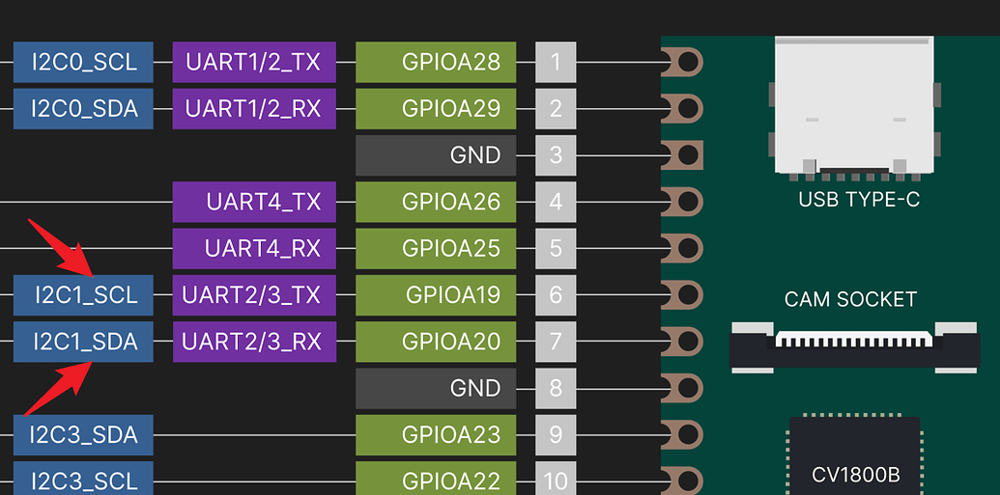
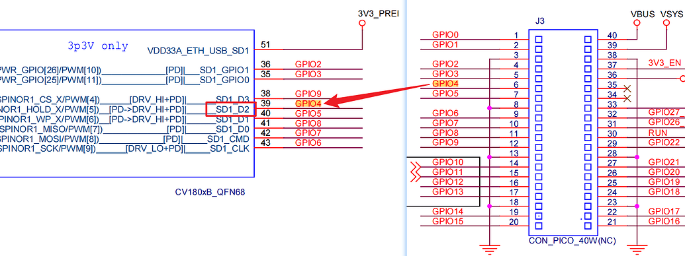
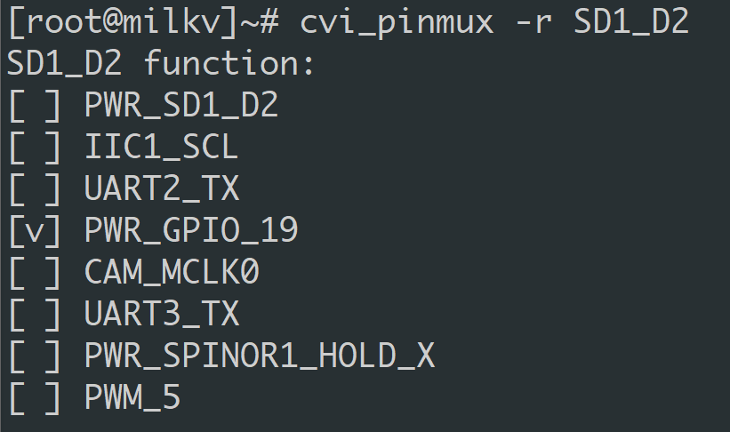

# Milk-V Duo 引脚复用配置工具 cvi_pinmux

## 代码来源

本仓库代码来源于仓库[cvi_alios_open](https://github.com/sophgo/cvi_alios_open)

## Usage

摘自[Milkv Duo社区](https://community.milkv.io/t/milk-v-duo-cvi-pinmux/292)

查看当前所有IO信息

```shell
cvi_pinmux -l
```

该工具查询或设置某个引脚，首先要知道这个引脚的名字，名字可以在原理图中找到

比如Duo的第6、7引脚，想配置为I2C接口



先查一下第6脚当前的状态，在原理图中找到引脚连接到CPU端的位置，靠近引脚的标注名就是我们需要的引脚的名字，这里是SD1_D2



查询这个引脚当前的配置:

```shell
cvi_pinmux -r SD1_D2
```



可以看到当前复用为GPIO_19, 我们这里需要设置为IIC1_SCL

```shell
cvi_pinmux -w SD1_D2/IIC1_SCL
```

再用`cvi_pinmux -r SD1_D2`查看的话，已经配置为IIC1_SCL了

同样的方法，把第7脚配置为IIC1_SDA

```shell
cvi_pinmux -w SD1_D1/IIC1_SDA
```

此时, 第6、7脚本已配置为I2C1，如果有接I2C设备的话，可以查看能否检测到设备的i2c地址:

```shell
i2cdetect -r -y 1
```
